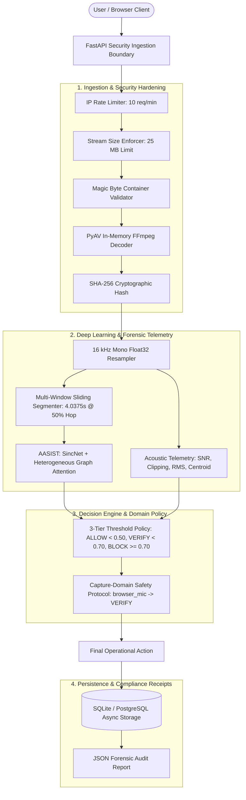

# SIH26104 — AI-Powered Voice Cloning Detection & Forensic Prevention Platform

[](https://fastapi.tiangolo.com)
[](https://nextjs.org)
[](https://pytorch.org)
[](file:///home/kiddo/projects/sih26104-voice-cloning/docs/05-ml/evaluation.md)
[](file:///home/kiddo/projects/sih26104-voice-cloning/docs/08-testing/backend-tests.md)

Production-grade forensic audio analysis and voice cloning defense system engineered for the **Smart India Hackathon (SIH 2026)** Problem Statement **SIH26104**: *"AI-Powered Real-Time Detection and Prevention of Voice Cloning Impersonation Attacks"*.

The platform inspects recorded and uploaded audio to detect synthetic speech, neural voice clones (ElevenLabs, XTTS-v2, Bark), voice conversion (RVC v2), and acoustic replay impersonation attacks. It combines raw waveform deep neural networks (**AASIST**), multi-window temporal localization, acoustic channel quality analysis, deterministic operational policy gating, and cryptographically fingerprinted audit reports.

---

## 📚 Complete Technical Documentation Hub

Comprehensive, verified technical documentation is available in the [`docs/`](file:///home/kiddo/projects/sih26104-voice-cloning/docs/README.md) hub:

- [**00. Project Overview & Requirements**](file:///home/kiddo/projects/sih26104-voice-cloning/docs/00-overview/project-overview.md) — Problem statement, functional requirements, and biometric terminology.
- [**01. System Architecture & Pipelines**](file:///home/kiddo/projects/sih26104-voice-cloning/docs/01-architecture/system-architecture.md) — Multi-tier topology, request flow sequence, and detection pipeline.
- [**02. Frontend Application**](file:///home/kiddo/projects/sih26104-voice-cloning/docs/02-frontend/frontend-architecture.md) — Next.js 15 App Router, React 19, WebAudio Canvas visualizers, and API client.
- [**03. Backend Microservices**](file:///home/kiddo/projects/sih26104-voice-cloning/docs/03-backend/backend-architecture.md) — FastAPI async architecture, REST API reference, and services deep dive.
- [**04. Database & Audit Evidence**](file:///home/kiddo/projects/sih26104-voice-cloning/docs/04-database/database-schema.md) — SQLAlchemy async ORM, migrations, and cryptographic audit receipts.
- [**05. Machine Learning & AASIST**](file:///home/kiddo/projects/sih26104-voice-cloning/docs/05-ml/aasist-architecture.md) — SincNet filters, graph attention fusion, multi-window inference, and certified ASVspoof benchmarks (0.80% EER).
- [**06. Microphone Domain Adaptation**](file:///home/kiddo/projects/sih26104-voice-cloning/docs/06-microphone-domain/microphone-domain-problem.md) — Four-stage research progression, physical transducer validation, and findings.
- [**07. Security Architecture & Threat Model**](file:///home/kiddo/projects/sih26104-voice-cloning/docs/07-security/security-architecture.md) — Streamed 25 MB limits, magic bytes, rate limiting, and STRIDE analysis.
- [**08. Automated Testing & Verification**](file:///home/kiddo/projects/sih26104-voice-cloning/docs/08-testing/testing-strategy.md) — 123 passed tests guide and validation scripts.
- [**09. Deployment & Operations**](file:///home/kiddo/projects/sih26104-voice-cloning/docs/09-deployment/local-development.md) — Local development, environment variables, Docker Compose, and production scaling.
- [**10. Hackathon Presentation & Judge Guide**](file:///home/kiddo/projects/sih26104-voice-cloning/docs/10-hackathon/demo-guide.md) — 3-part live demo script, test audio fixtures, and judge Q&A preparation.

---

## 🏛️ High-Level System Architecture



---

## 🚀 Key Capabilities & Differentiators

1. **AASIST Deep Learning Architecture**: Directly inspects raw time-domain waveforms using 70 parametric SincNet sinc-bandpass filters, 6 residual blocks, and dual-branch Heterogeneous Spectro-Temporal Graph Attention Networks (0.8047% EER on official ASVspoof 2019 LA evaluation benchmark, 297,866 total parameters).
2. **75% Overlapping Multi-Window Temporal Analysis**: Slices arbitrary-length audio into 64,600-sample (~4.04s) windows with a **75% overlap (16,150-sample / ~1.01s hop)**, applying **`max_v1` conservative maximum risk aggregation** (with low-energy silence exclusion) to prevent attackers from bypassing detection via short cloned phrases.
3. **Forensic Signal Quality Telemetry**: Automatically measures Signal-to-Noise Ratio (SNR), clipping sample percentage, RMS energy, spectral centroid, and zero-crossing rate.
4. **Three-Tier Policy Decision Engine**:
   - $P_{\text{synth}} < 0.50 \implies \mathbf{ALLOW}$ (Low Risk / Real Speech)
   - $0.50 \le P_{\text{synth}} < 0.70 \implies \mathbf{VERIFY}$ (Medium Risk / Secondary Verification)
   - $P_{\text{synth}} \ge 0.70 \implies \mathbf{BLOCK}$ (High Risk / Synthesized Voice Attack)
5. **Capture-Domain Safety Protocol**: Distinguishes certified uploaded files (`trusted_file`) from real-time browser microphone recordings (`unvalidated`), safely overriding operational actions to `VERIFY` (prompting for secondary MFA) to protect legitimate users against acoustic domain-shift false blocks.
6. **Immutable Cryptographic Audit Receipts**: Generates structured JSON forensic reports (`/api/v1/detections/{id}/report`) containing SHA-256 integrity fingerprints, temporal window timelines, and signal quality metrics for compliance and legal non-repudiation.

---

## ⚡ Quick Start & Local Setup

### 1. Backend Setup
```bash
cd backend
python -m venv .venv
source .venv/bin/activate
pip install -r requirements.txt
cp ../.env.example .env
pytest
uvicorn app.main:app --host 0.0.0.0 --port 8000 --reload
```
API available at `http://localhost:8000` | Swagger UI at `http://localhost:8000/docs`.

### 2. Frontend Setup
```bash
cd frontend
npm install
npm run build
npm run dev
```
Web console available at `http://localhost:3000`.

### 3. Docker Multi-Container Launch
```bash
docker compose up -d --build
```

---

## 🎬 Hackathon Live Demonstration Sequence

| Demo Stage | Scenario | Input Audio | Expected Prediction | Expected Action |
| :--- | :--- | :--- | :--- | :--- |
| **Demo 1** | Authentic Human Voice | `clean_bona.flac` | `real` ($P < 0.01$) | `ALLOW` (Green Badge) |
| **Demo 2** | AI-Generated Deepfake Clone | `clean_spoof.flac` | `synthetic` ($P > 0.99$) | `BLOCK` (Red Badge) |
| **Demo 3** | Live Browser Microphone | Browser Mic Recording | Preserves Raw CM | `VERIFY` (Domain Unvalidated / MFA) |

---

## 👤 Author & Maintainer

**Kevin Matthew S**
Developed for the **Smart India Hackathon (SIH 2026)** under Problem Statement **SIH26104**.
