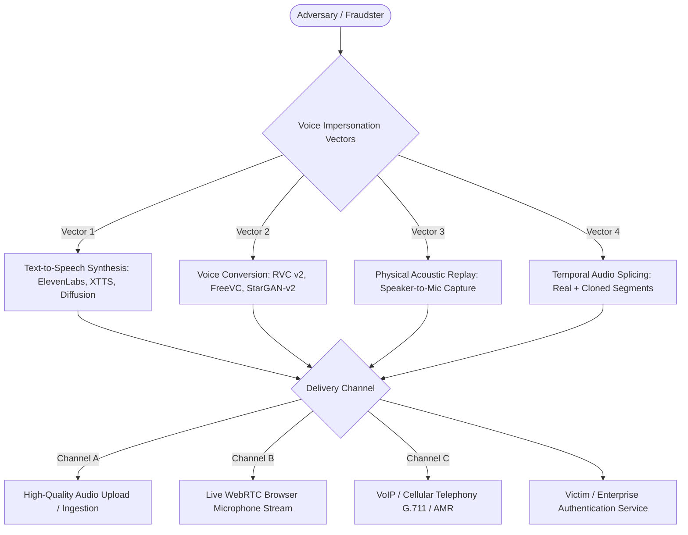

# Problem Statement & Threat Landscape: SIH26104

## 1. Problem Statement Overview

**SIH Problem Statement ID**: `SIH26104`  
**Title**: *AI-Powered Real-Time Detection and Prevention of Voice Cloning Impersonation Attacks*  
**Category**: Cybersecurity, Artificial Intelligence, Digital Identity Protection  

The proliferation of accessible generative AI, zero-shot text-to-speech (TTS), and real-time voice conversion (RVC) technologies has democratized audio deepfakes. Attackers now require fewer than 3 seconds of reference human audio to clone a victim's voice with high fidelity, creating a critical vulnerability across:
- **Banking & Voice Biometrics**: Telephone banking authentication, wire transfer approvals, customer identity verification.
- **Enterprise Social Engineering**: CEO fraud ("vishing"), executive authorization scams, employee credentials harvesting.
- **Consumer Fraud & Extortion**: Urgent family emergency scams, kidnapping hoaxes, conversational AI impersonation.

---

## 2. Threat Vector Taxonomy

### 2.1 Attack Vector Profiles

| Vector | Description | Acoustic Characteristics | Detection Challenge |
| :--- | :--- | :--- | :--- |
| **Neural TTS (Text-to-Speech)** | Text converted to speech using autoregressive transformers (e.g. ElevenLabs Turbo v2.5, XTTS-v2, Bark). | Unnatural pitch contour regularity, neural vocoder sub-band phase artifacts. | Highly natural prosody; requires high-frequency phase analysis. |
| **Voice Conversion (VC)** | Source speaker's speech converted into target speaker's vocal timbre (e.g. RVC v2, So-VITS). | Natural human breathing rhythms preserved; localized formant shift anomalies. | Retains natural linguistic timing and prosody, fooling naive frequency-envelope detectors. |
| **Temporal Audio Splicing** | Attacker splices 500 ms – 1000 ms cloned keywords (e.g. *"Yes, authorize payment"*) into legitimate audio. | Abrupt boundary phase discontinuities; localized synthetic window. | Truncation or global average pooling misses short localized splices. |
| **Acoustic Replay** | Cloned or genuine speech played over physical loudspeakers and re-captured. | Added room reverberation, speaker enclosure resonance, ambient background noise. | Distinguishing between genuine room noise and malicious playback. |

---

## 3. Core Technical Challenges

1. **Acoustic Domain Mismatch**: A model trained on clean 16 kHz studio recordings fails when exposed to lossy Opus/AAC codecs, browser WebRTC acoustic echo cancellation, and low-cost electret/MEMS laptop microphones.
2. **Short-Duration Splicing**: Attackers embed minimal synthetic snippets into long genuine recordings. Conventional fixed-length 3-second truncation misses splices occurring later in the file.
3. **Defense-in-Depth vs. Low Latency**: Detection must execute in $< 500 \text{ ms}$ while performing multi-tier format validation, streaming size checks, and deep neural inference without introducing Denial of Service vulnerabilities.
4. **False Positive Prevention in Banking**: A false BLOCK on genuine customers degrades user trust, while a false ALLOW enables multi-million-dollar fraudulent transfers.

---

## 4. Solution Strategy

VOICE-GUARD solves these challenges through:
- **Raw Waveform AASIST Front-end**: Eliminates lossy Fourier transforms by learning raw sinc-filter frequency bands.
- **Multi-Window Overlapping Inference**: Analyzes every 4.0375-second window with $75\%$ overlap (16,150-sample hop), aggregating via conservative `max_v1` risk evaluation with low-energy silence exclusion.
- **Three-Tier Policy Engine**: Translates raw probabilities into calibrated enterprise actions (`ALLOW`, `VERIFY`, `BLOCK`).
- **Domain-Aware Policy Overrides**: Quarantines unvalidated capture domains to `VERIFY` (requesting multi-factor authentication) without blocking legitimate customers.
