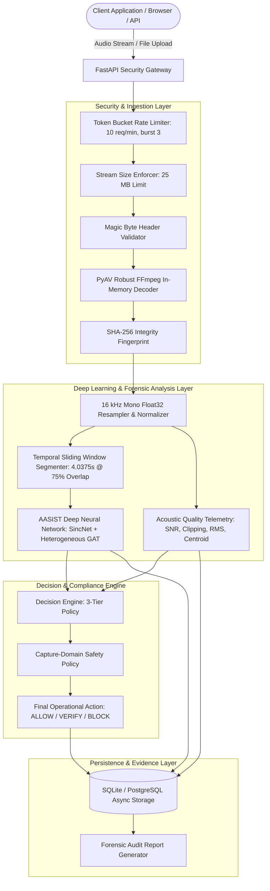

# Project Overview: SIH26104 VOICE-GUARD

## 1. Executive Summary

**VOICE-GUARD (SIH26104)** is an enterprise-grade, AI-powered anti-spoofing and synthetic speech detection platform developed for the **Smart India Hackathon 2026**. The platform addresses the escalating security crisis of AI voice cloning, deepfake audio impersonation, and synthetic biometric bypass in financial transactions, customer service authentication, and high-assurance identity verification workflows.

At its core, VOICE-GUARD combines:
1. **State-of-the-Art Deep Learning**: The **AASIST** (Audio Anti-Spoofing using Integrated Spectro-Temporal Graph Attention Networks) deep learning architecture, operating directly on raw 16 kHz audio waveforms via SincNet filterbanks and heterogeneous graph neural networks.
2. **Robust Multi-Window Inference**: Sliding temporal window segmentation (64,600 samples / 4.0375s @ 75% overlap / 16,150-sample hop) with conservative maximum risk aggregation (`max_v1`) and low-energy silence exclusion to detect transient, short-duration voice cloning splices without length truncation.
3. **Signal Quality & Forensic Telemetry**: In-depth audio signal inspection measuring Signal-to-Noise Ratio (SNR), clipping ratio, RMS energy, spectral centroid, zero-crossing rate, dynamic range, and bandwidth.
4. **Three-Tier Policy Decision Engine**: Automated risk classification producing operational enforcement directives:
   - $P_{\text{synth}} < 0.50 \implies \mathbf{ALLOW}$ (Low Risk / Real Speech)
   - $0.50 \le P_{\text{synth}} < 0.70 \implies \mathbf{VERIFY}$ (Medium Risk / Secondary Challenge)
   - $P_{\text{synth}} \ge 0.70 \implies \mathbf{BLOCK}$ (High Risk / Synthesized Speech Attack)
5. **Capture-Domain Safety Protocol**: Domain-aware reliability enforcement distinguishing between certified uploaded files and browser microphone captures, safeguarding against acoustic domain-shift false positives.
6. **Immutable Forensic Audit Ledger**: Complete detection history preservation including SHA-256 integrity fingerprints, temporal window telemetry, signal quality metrics, and cryptographic verification receipts.

---

## 2. High-Level System Architecture

---

## 3. Core Capabilities & Value Propositions

| Feature | Implementation | Business & Security Value |
| :--- | :--- | :--- |
| **Direct Waveform Inspection** | SincNet parametric bandpass front-end | Captures raw spectral phase discontinuities and neural vocoder artifacts without lossy STFT/Mel spectrogram transformations. |
| **Graph Attention Fusion** | Heterogeneous Spectro-Temporal Graph Network | Models long-range spectro-temporal dependencies and vocoder synthesis glitches across heterogeneous acoustic sub-bands. |
| **Multi-Window Splice Detection** | 64,600-sample windowing with $75\%$ overlap (16,150 hop) and `max_v1` aggregation | Prevents attacker bypass using short (e.g. 500 ms) cloned audio segments inserted into authentic conversations. |
| **Deterministic Policy Actions** | Three-tier decision engine ($P < 0.50, 0.50 \le P < 0.70, P \ge 0.70$) | Replaces vague probability scores with clear, deterministic banking/security operational directives. |
| **Forensic Integrity Receipts** | Cryptographic SHA-256 hashing & metadata audit | Provides non-repudiation and chain-of-custody evidence for forensic incident response teams. |
| **Defense-in-Depth Hardening** | 25 MB stream caps, FFmpeg format sandboxing, concurrency admission control | Hardened against Denial of Service (DoS), zip bombs, audio buffer overflows, and malformed header exploits. |

---

## 4. Key Differentiators

Unlike generic anti-spoofing research demos, VOICE-GUARD is architected as an **auditable, production-hardened platform**:
- **Honest Domain Boundaries**: It explicitly acknowledges and isolates physical microphone acoustic domain shift (`capture_domain_reliability = unvalidated`), preventing false blocks on real users while keeping biometric evidence intact.
- **Async Non-Blocking Architecture**: FastAPI async I/O coupled with PyTorch inference in thread pools prevents compute starvation under heavy traffic.
- **Enterprise UI/UX**: Next.js 15 App Router interface featuring dark-mode glassmorphism, real-time waveform visualization, interactive audio players, and forensic breakdown drawers.

---

## 5. Related Documentation Links

- [Problem Statement & Threat Landscape](file:///home/kiddo/projects/sih26104-voice-cloning/docs/00-overview/problem-statement.md)
- [System Architecture Specification](file:///home/kiddo/projects/sih26104-voice-cloning/docs/01-architecture/system-architecture.md)
- [Deep Learning AASIST Engine](file:///home/kiddo/projects/sih26104-voice-cloning/docs/05-ml/aasist-architecture.md)
- [Decision Engine Policy Rules](file:///home/kiddo/projects/sih26104-voice-cloning/docs/07-security/decision-engine.md)
- [Microphone Domain Adaptation Research](file:///home/kiddo/projects/sih26104-voice-cloning/docs/06-microphone-domain/microphone-domain-problem.md)
