# Detection Pipeline Specification: SIH26104

## 1. Pipeline Overview

The **VOICE-GUARD Detection Pipeline** transforms raw, potentially untrusted audio streams into verified forensic evidence, synthetic probability estimates, and operational security decisions.

```mermaid
flowchart TD
    RawAudio["Raw Audio Input (.wav, .mp3, .ogg, .flac, .m4a, .webm)"]
    
    subgraph Step1["1. Ingestion & Security Hardening"]
        SizeCheck["Streaming Size Check (Max 25 MB)"]
        MagicCheck["Magic Bytes & MIME Validation"]
        SHA["SHA-256 Cryptographic Fingerprint"]
    end
    
    subgraph Step2["2. Audio Decoding & Normalization"]
        PyAV["PyAV (FFmpeg) Stream Decoder"]
        Resample["16,000 Hz Mono Resampler"]
        PeakNorm["Peak Amplitude Normalization ([-1.0, 1.0])"]
        PadWrap["Deterministic 64,600-Sample Wrap Padding"]
    end
    
    subgraph Step3["3. Forensic Quality Extraction"]
        SNR["WADA / Percentile Signal-to-Noise Ratio (dB)"]
        Clipping["Clipping Sample Detection (> 0.99)"]
        Spectral["Spectral Centroid, Bandwidth & Rolloff"]
        ZCR["Zero-Crossing Rate & RMS Energy"]
    end
    
    subgraph Step4["4. Deep Neural Multi-Window AASIST"]
        WindowSplit["Sliding Window Segmentation (64,600 samples / 75% overlap / 16,150 hop)"]
        LowEnergyExcl["Low-Energy Pre-Exclusion (RMS < -55 dBFS, Active < 0.05)"]
        SincNet["Parametric SincNet Filterbanks (conv_time)"]
        ResEnc["Residual Graph Encoders"]
        GAT["Heterogeneous Spectro-Temporal Graph Attention"]
        Readout["Linear Readout Layer (160 -> 2)"]
        MaxV1["Conservative Maximum Risk Aggregation (max_v1)"]
    end
    
    subgraph Step5["5. Decision Engine Policy Evaluation"]
        ScoreEval["Thresholding (ALLOW < 0.50, VERIFY < 0.70, BLOCK >= 0.70)"]
        DomainEval["Capture-Domain Override (browser_mic -> VERIFY)"]
    end
    
    RawAudio --> SizeCheck --> MagicCheck --> SHA --> PyAV --> Resample --> PeakNorm --> PadWrap
    Resample --> SNR & Clipping & Spectral & ZCR
    PadWrap --> WindowSplit --> LowEnergyExcl --> SincNet --> ResEnc --> GAT --> Readout --> MaxV1
    MaxV1 & SNR & Clipping --> ScoreEval --> DomainEval --> Output["Final Detection Result DTO"]
```

---

## 2. Pipeline Stages Detailed Breakdown

### Stage 1: Ingestion & Security Hardening
- **File Size Cap**: Monitored on a chunk-by-chunk basis during streaming to prevent RAM exhaustion.
- **Magic Bytes Validation**: Header bytes are compared to known signatures before any decoding starts.
- **SHA-256 Hashing**: Calculated simultaneously as chunks are read, producing the immutable integrity fingerprint.

### Stage 2: Audio Decoding & Resampling
- **PyAV In-Memory Ingestion**: PyAV safely parses multi-stream audio containers into uncompressed Float32 PCM numpy arrays.
- **16 kHz Standardization**: All audio is resampled to 16,000 Hz single-channel mono.
- **Minimum Duration Wrap**: If duration is $< 4.0375\text{ seconds}$ (64,600 samples), the waveform is repeated/wrapped deterministically to fill the 64,600-sample input requirement without silence-induced artificial boundary spikes.

### Stage 3: Quality Telemetry Analysis (`AudioQualityAnalyzer`)
Extracts forensic signal characteristics:
- **SNR (dB)**: Measures background acoustic noise contamination.
- **Clipping Ratio**: Detects microphone pre-amp saturation.
- **RMS Energy**: Measures signal loudness contour.
- **Spectral Centroid (Hz)**: Measures spectral energy balance (identifies vocoder low-pass filtering).

### Stage 4: Multi-Window AASIST Inference
- **Window Geometry**: Window size $L = 64,600\text{ samples}$ (4.0375 seconds), hop size $H = 16,150\text{ samples}$ (1.009375 seconds, $75\%$ overlap).
- **Low-Energy Silence Exclusion**: Windows with $\text{RMS} < -55\text{ dBFS}$ or active speech fraction $< 0.05$ are excluded prior to neural inference to avoid diluting speech evidence.
- **Inference per Window**: Computes logits $[\text{logit}_{\text{spoof}}, \text{logit}_{\text{bonafide}}]$.
- **Window Countermeasure**: $CM_w = \text{logit}_{\text{bonafide}} - \text{logit}_{\text{spoof}}$.
- **Window Probability**: $P_{\text{synth}, w} = \frac{1}{1 + e^{CM_w}}$.
- **`max_v1` Risk Aggregation**: Across all eligible speech windows, the recording-level synthetic probability and countermeasure score are:
  $$P_{\text{synth}} = \max_{w \in \text{eligible}} P_{\text{synth}, w}, \quad CM = \min_{w \in \text{eligible}} CM_w$$
- **Suspicious Segment Merging**: Overlapping or contiguous windows with $P_{\text{synth}, w} \ge 0.50$ are merged into distinct time intervals.

### Stage 5: Decision Engine Evaluation
- Evaluates $P_{\text{synth}}$ against production thresholds.
- Applies domain context checks (`browser_microphone` overrides final action to `VERIFY`).
- Projects results into structured Pydantic DTOs for persistent database storage and UI display.
