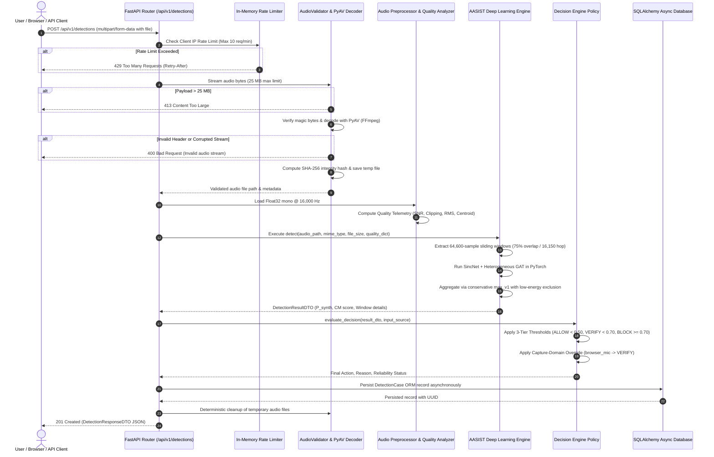

# Request Flow & Execution Lifecycle: SIH26104

## 1. End-to-End Request Flow Diagram

---

## 2. Step-by-Step Lifecycle Analysis

### Step 1: Ingestion & Rate Limit Verification
When a request arrives at `POST /api/v1/detections`:
1. The client IP is checked against the process-local token bucket rate limiter in [backend/app/core/rate_limiter.py](file:///home/kiddo/projects/sih26104-voice-cloning/backend/app/core/rate_limiter.py).
2. If the client has exhausted available tokens (rate: 10/min, burst: 3), it is immediately rejected with HTTP 429 and a `Retry-After` header.

### Step 2: Streamed Validation & Size Enforcement
1. The uploaded file is read in 64 KB chunks.
2. If total bytes read exceed **25 MB ($26,214,400\text{ bytes}$)**, streaming terminates immediately and returns HTTP 413 without reading remaining bytes into memory.
3. Magic bytes are validated against known signatures (`RIFF` for WAV, `OggS` for OGG, `\x1a\x45\xdf\xa3` for WebM/EBML, `fLaC` for FLAC, `ID3` for MP3).

### Step 3: Decoding & Forensic Hash Generation
1. `AudioDecoder.decode_to_numpy()` uses PyAV (FFmpeg C bindings) to decode compressed containers directly into uncompressed Float32 PCM.
2. A SHA-256 hash is computed over the raw incoming bytes to serve as the immutable forensic integrity fingerprint.

### Step 4: Quality Telemetry & Preprocessing
1. Audio is resampled to mono 16 kHz and normalized to $[-1.0, 1.0]$.
2. `AudioQualityAnalyzer` estimates SNR, clipping percentage, RMS energy, spectral centroid, zero-crossing rate, dynamic range, and bandwidth.

### Step 5: Multi-Window AASIST Inference
1. The audio is segmented into 4.0375-second (64,600 samples) windows with a $75\%$ overlap (16,150 samples / ~1.01s hop).
2. Low-energy / silent windows ($\text{RMS} < -55\text{ dBFS}$ or active speech fraction $< 0.05$) are excluded prior to neural inference.
3. For each eligible window, the frozen AASIST deep neural network produces bonafide and spoof logits.
4. The overall synthetic probability is aggregated via `max_v1` (maximum synthetic probability and minimum countermeasure score across all eligible windows).

### Step 6: Decision Engine & Policy Enforcement
1. The decision engine maps $P_{\text{synth}}$ to raw ML actions:
   - $P_{\text{synth}} < 0.50 \implies \text{ALLOW}$
   - $0.50 \le P_{\text{synth}} < 0.70 \implies \text{VERIFY}$
   - $P_{\text{synth}} \ge 0.70 \implies \text{BLOCK}$
2. If `input_source == "browser_microphone"`, the engine sets `capture_domain_reliability = "unvalidated"` and overrides the final action to `VERIFY`.

### Step 7: Persistence & Response
1. The detection case is written asynchronously to the database.
2. Temporary files are deleted in a `finally` block.
3. The client receives a structured `DetectionResponseDTO` JSON payload with HTTP 201 Created.
