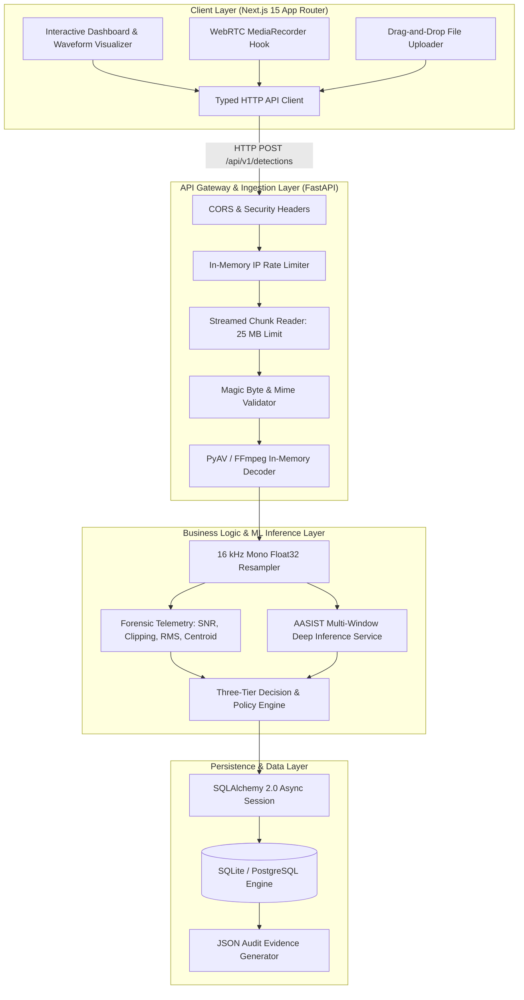

# System Architecture Specification: SIH26104

## 1. Architectural Philosophy

The **VOICE-GUARD (SIH26104)** architecture is designed around four foundational engineering principles:
1. **Defense-in-Depth Security**: Untrusted audio streams are quarantined and validated across multiple independent security gates before entering the deep learning execution runtime.
2. **Deterministic Domain Isolation**: Machine learning model inference is separated from operational policy enforcement, preventing acoustic domain shifts from causing unverified false rejections.
3. **Asynchronous Non-Blocking Execution**: Heavy PyTorch tensor calculations execute inside dedicated background worker threads (`asyncio.to_thread`) to maintain sub-millisecond API event loop responsiveness.
4. **Complete Forensic Traceability**: Every detection request is assigned a unique UUID and cryptographically fingerprinted with SHA-256 to ensure forensic non-repudiation.

---

## 2. Multi-Tier System Topology

---

## 3. Subsystem Breakdown

### 3.1 Frontend Web Application (`/frontend`)
- Built with **Next.js 15 App Router**, **React 19**, and **TypeScript**.
- Utilizes **Tailwind CSS v4** with a custom dark-mode glassmorphic design system.
- Implements direct WebAudio waveform analysis via Canvas 2D and WebRTC `MediaRecorder` for uncompressed microphone streaming.
- Provides real-time threat badges, probability gauges, temporal window breakdowns, and one-click JSON audit report exports.

### 3.2 Backend Service Engine (`/backend`)
- Built on **FastAPI** with **Uvicorn** and Python 3.14 async runtime.
- Employs strict Pydantic v2 schemas for request validation and response serialization.
- Manages audio validation through `AudioValidator` and `AudioDecoder` using PyAV (FFmpeg 6/7 bindings) to handle fragmented or malformed audio containers.

### 3.3 Deep Learning Anti-Spoofing Service (`backend/app/services/detection/aasist_service.py`)
- Loads the official **AASIST** deep neural network (`AASIST.pth`, SHA-256: `51d2d9cf0738172f...`).
- Splits audio into 64,600-sample windows (4.0375s) with 50% overlap.
- Employs top-$k$ ($k=5$) worst-case risk aggregation to detect short-duration voice cloning splices without length truncation.

### 3.4 Decision Engine (`backend/app/services/decision_engine.py`)
- Evaluates raw model probabilities against certified thresholds ($P < 0.50 \to \text{ALLOW}, 0.50 \le P < 0.70 \to \text{VERIFY}, P \ge 0.70 \to \text{BLOCK}$).
- Applies capture-domain safety rules: if input source is `browser_microphone`, sets `capture_domain_reliability = unvalidated` and emits operational action `VERIFY` to request multi-factor authentication.

### 3.5 Database & Audit Layer (`backend/app/models` & `backend/app/services/evidence_report.py`)
- Persists all detection records, raw logits, countermeasure scores, signal quality metrics, and window telemetry in SQLite (development) or PostgreSQL (production).
- Generates cryptographic verification reports containing full provenance metadata.

---

## 4. Key Design Patterns

| Pattern | Implementation | Location |
| :--- | :--- | :--- |
| **Factory Pattern** | `DetectionServiceFactory` instantiates detection engines dynamically based on `DETECTION_ENGINE` config (`aasist`, `baseline`, `mock`). | [backend/app/services/detection/factory.py](file:///home/kiddo/projects/sih26104-voice-cloning/backend/app/services/detection/factory.py) |
| **Service Layer Pattern** | Business logic (validation, decoding, inference, decision policy) is isolated into modular service classes. | [backend/app/services/](file:///home/kiddo/projects/sih26104-voice-cloning/backend/app/services/) |
| **Async Repository Pattern** | CRUD database operations use asynchronous sessions and SQLAlchemy ORM models. | [backend/app/db/session.py](file:///home/kiddo/projects/sih26104-voice-cloning/backend/app/db/session.py) |
| **Circuit Breaker / Defense-in-Depth** | Ingestion pipeline checks stream size, magic bytes, decoder stability, and inference bounds sequentially before committing resources. | [backend/app/services/audio_validator.py](file:///home/kiddo/projects/sih26104-voice-cloning/backend/app/services/audio_validator.py) |
