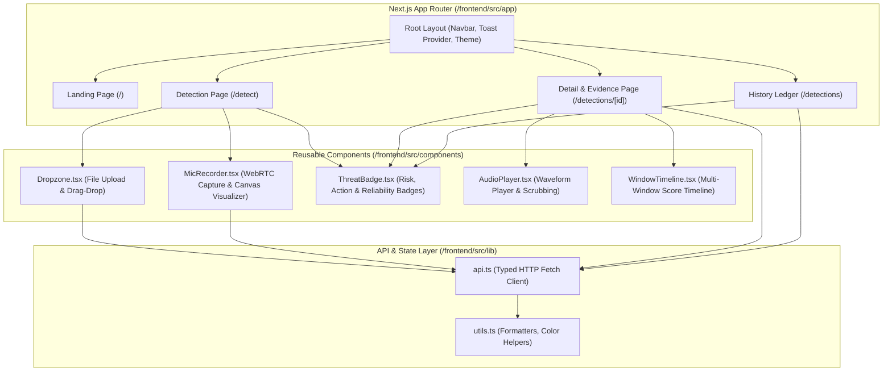

# Frontend Architecture: SIH26104

## 1. Overview & Technology Stack

The **VOICE-GUARD Frontend** is a modern, high-performance web interface built with **Next.js 15 (App Router)**, **React 19**, and **TypeScript**. It provides enterprise security teams with real-time audio analysis, interactive multi-window forensic timelines, audio playback with synchronized waveform visualizers, and audit report generation.

| Technology | Version | Purpose |
| :--- | :--- | :--- |
| **Next.js** | 15.1.x | App Router architecture, server-rendered layouts, static client routes. |
| **React** | 19.x | Component lifecycle, UI hooks, and state management. |
| **TypeScript** | 5.x | Strict type safety across all API payloads and component interfaces. |
| **Tailwind CSS** | v4 | Modern styling with custom dark-mode glassmorphism. |
| **Lucide React** | Latest | Unified security and forensic icon library. |
| **WebAudio / WebRTC** | Native | Direct browser microphone streaming and Canvas 2D waveform rendering. |

---

## 2. Design System & Aesthetics

The user interface implements a **Cyber-Security Dark Mode Glassmorphism** design language:
- **Color Palette**: Tailored slate/zinc neutral backdrops (`#090d16`, `#0f172a`) paired with vivid status accents:
  - **Emerald Green (`#10b981`)**: Low Risk / Bonafide Speech / `ALLOW` action.
  - **Amber Yellow (`#f59e0b`)**: Medium Risk / Suspicious Speech / `VERIFY` action.
  - **Crimson Red (`#ef4444`)**: High Risk / Synthetic Speech / `BLOCK` action.
  - **Cyan/Indigo (`#06b6d4`, `#6366f1`)**: Forensic Telemetry & Audio Waveforms.
- **Glassmorphism Panels**: `backdrop-blur-md bg-slate-900/60 border border-slate-800/80` for depth and elevation.
- **Micro-Animations**: Smooth transitions on hover, dynamic pulsing recording badges, and interactive probability gauges.

---

## 3. Component Architecture & Data Flow

---

## 4. State Management & Async Data Fetching

- **Local Component State**: Managed via standard React hooks (`useState`, `useCallback`, `useRef`, `useEffect`).
- **Server Communication**: Asynchronous HTTP requests using native `fetch` wrapped in typed functions (`analyzeAudioFile`, `getDetectionById`, `getDetectionsList`, `downloadEvidenceReport`).
- **Streaming Upload Handling**: Direct `FormData` streaming to `/api/v1/detections` with client-side abort controllers and progress feedback.
