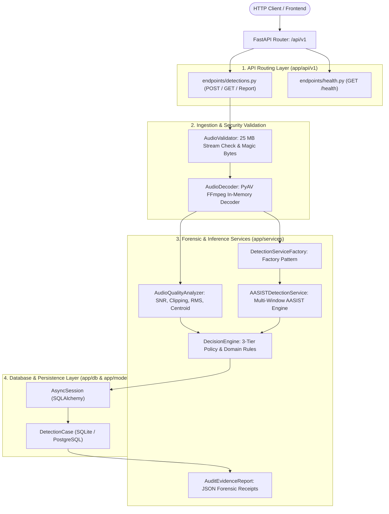

# Backend Architecture: SIH26104

## 1. Overview & Technology Stack

The **VOICE-GUARD Backend** is a high-throughput, asynchronous RESTful microservice built with **FastAPI** and Python 3.14. It handles multipart audio ingestion, streaming validation, in-memory decoding, deep learning neural inference, audio quality analysis, decision engine policy evaluation, and forensic audit logging.

| Component | Technology | Version | Purpose |
| :--- | :--- | :--- | :--- |
| **API Framework** | FastAPI | 0.115.x | Asynchronous routing, OpenAPI documentation, dependency injection. |
| **ASGI Server** | Uvicorn | 0.34.x | High-performance ASGI runtime for Python async I/O. |
| **Data Validation** | Pydantic v2 | 2.10.x | Request/response data serialization and strict type contracts. |
| **ORM / Database** | SQLAlchemy | 2.0.x Async | Asynchronous database access and migration-ready schema modeling. |
| **Deep Learning** | PyTorch | 2.x | Neural network computation (AASIST graph models). |
| **Audio Processing** | PyAV & SoundFile | 14.x / 0.13.x | In-memory FFmpeg stream decoding and audio resampling. |

---

## 2. Layered Architecture Diagram



---

## 3. Key Design Conventions

1. **Dependency Injection**: Database sessions (`get_db`) and detection services (`get_detection_service`) are injected via FastAPI dependencies, enabling seamless unit testing and mocking.
2. **Asynchronous Thread Offloading**: Because PyTorch neural forward passes are CPU/GPU-bound synchronous operations, they are wrapped in `asyncio.to_thread` or executed within dedicated worker pools to prevent blocking the Uvicorn event loop:
   ```python
   result = await asyncio.to_thread(service.detect, audio_path, mime_type, file_size, quality_dict)
   ```
3. **Fail-Safe Cleanup**: Uploaded audio files and decoded PCM buffers are cleaned up deterministically inside `finally` blocks:
   ```python
   finally:
       if temp_path and os.path.exists(temp_path):
           os.remove(temp_path)
   ```
4. **Environment-Driven Configuration**: Settings are centralized in `app/core/config.py` using `pydantic_settings.BaseSettings`, reading directly from `.env` or system environment variables.
