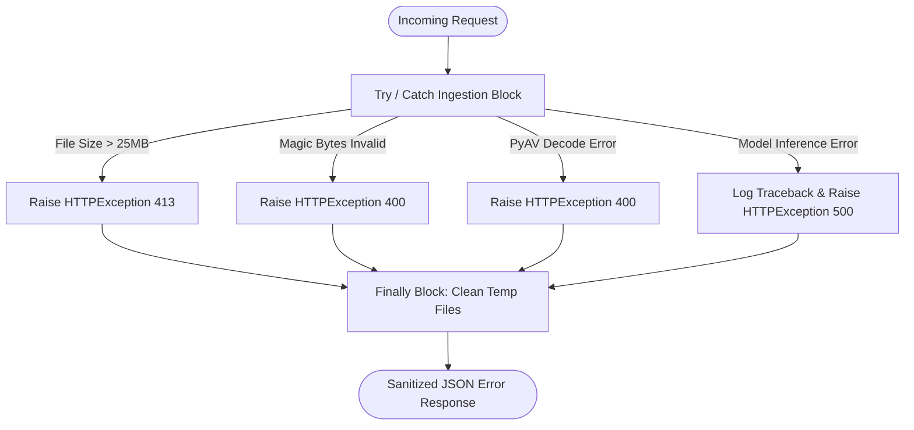

# Backend Error Handling & Resilience: SIH26104

## 1. Error Handling Philosophy

The backend implements unified, secure, and sanitized error handling designed to:
1. **Prevent Information Disclosure**: Internal stack traces, database credentials, and raw system paths are never leaked to external API clients.
2. **Deterministic HTTP Status Codes**: Explicit mappings from failure conditions to standard RFC HTTP status codes.
3. **Guaranteed Resource Cleanup**: Filesystem artifacts and allocated memory buffers are cleaned up deterministically upon error.

---

## 2. HTTP Status Code Mapping Matrix

| Status Code | RFC Name | Cause in VOICE-GUARD | Sanitized Response Example |
| :--- | :--- | :--- | :--- |
| **`400`** | Bad Request | Malformed audio stream, invalid magic bytes, unsupported container, or un-decodable audio. | `{"detail": "Uploaded file is not a valid or supported audio file"}` |
| **`404`** | Not Found | Detection UUID does not exist in the database. | `{"detail": "Detection case not found"}` |
| **`413`** | Content Too Large | Upload stream exceeds 25 MB (`26,214,400` bytes). | `{"detail": "File exceeds maximum allowed size of 25MB"}` |
| **`422`** | Unprocessable Content | Malformed UUID v4 path parameter or invalid JSON schema. | `{"detail": [{"loc": ["path", "id"], "msg": "Invalid UUID format", "type": "value_error"}]}` |
| **`429`** | Too Many Requests | Client IP exceeds the rate limit (10 req/min). | `{"detail": "Rate limit exceeded. Maximum 10 requests per minute."}` |
| **`503`** | Service Unavailable | Requested detection engine or required model weight file is missing on disk. | `{"detail": "Detection engine aasist is unavailable: weights file not found."}` |
| **`500`** | Internal Server Error | Unhandled runtime exception during tensor computation. | `{"detail": "An internal error occurred while processing the audio stream."}` |

---

## 3. Exception Handling Architecture



---

## 4. Temporary File Cleanup Guarantee

In [backend/app/api/v1/endpoints/detections.py](file:///home/kiddo/projects/sih26104-voice-cloning/backend/app/api/v1/endpoints/detections.py), temporary files written to `uploads/` are tracked and deleted unconditionally:

```python
temp_path = None
try:
    temp_path, mime_type, file_size = await AudioValidator.validate_and_save_stream(file)
    result = await asyncio.to_thread(service.detect, temp_path, mime_type, file_size, quality_dict)
    # Persist and return response...
except HTTPException:
    raise
except Exception as e:
    logger.error("Detection processing failed: %s", str(e), exc_info=True)
    raise HTTPException(status_code=500, detail="An internal error occurred while processing the audio stream.")
finally:
    if temp_path and os.path.exists(temp_path):
        try:
            os.remove(temp_path)
        except OSError as err:
            logger.warning("Failed to remove temp file %s: %s", temp_path, str(err))
```
