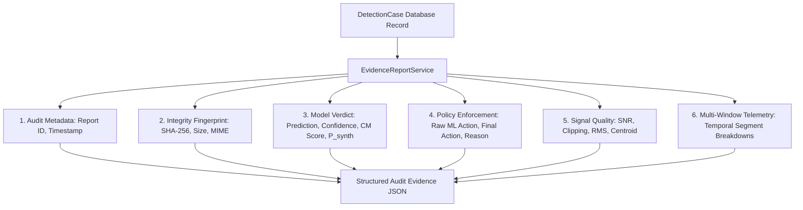

# Forensic Audit Evidence & Compliance Receipts: SIH26104

## 1. Overview & Forensic Principles

The **Forensic Audit Evidence System** in VOICE-GUARD provides non-repudiation, chain-of-custody verification, and forensic telemetry receipts for compliance officers, fraud analysts, and security operations centers (SOC).

> [!IMPORTANT]
> **Integrity Fingerprint vs. Tamper-Proofing**:  
> The SHA-256 hash serves as a **cryptographic integrity fingerprint** of the ingested audio byte stream. It guarantees that any subsequent alteration, re-encoding, or clipping of the file will produce a different hash, establishing forensic tamper-detection. It is not described as "tamper-proof storage".

---

## 2. Audit Evidence Schema (`backend/app/services/evidence_report.py`)

The evidence generator projects database records into a standardized JSON audit receipt:

---

## 3. Evidence Report Sections

### 1. Header & Provenance
- `report_id`: Unique UUID generated at the time of report creation.
- `detection_id`: Foreign key referencing the primary `detection_cases.id`.
- `generated_at`: ISO-8601 UTC timestamp.

### 2. Audio Integrity Fingerprint
- `sha256`: Hexadecimal SHA-256 digest computed across the raw audio payload.
- `filename`: Cleansed original file name.
- `file_size_bytes`: Byte count of the file.
- `mime_type`: Container format and codec string.

### 3. Model Verdict & Raw Scores
- `model_version`: Exact model identity (e.g. `aasist-v1`).
- `countermeasure_score`: Raw logit differential ($CM$).
- `synthetic_probability`: Model probability estimate ($P_{\text{synth}}$).
- `prediction`: Binary classification verdict (`"real"` or `"synthetic"`).

### 4. Policy Decision Rationale
- `raw_ml_action`: Policy decision before capture-domain checks (`ALLOW`, `VERIFY`, `BLOCK`).
- `operational_action`: Final enforced security action (`ALLOW`, `VERIFY`, `BLOCK`).
- `capture_domain_reliability`: Integrity status of the acoustic capture environment (`trusted_file` vs `unvalidated`).
- `decision_reason`: Detailed textual explanation.

### 5. Acoustic & Multi-Window Telemetry
- `quality_metrics`: Forensic descriptors (SNR dB, clipping ratio, RMS, spectral centroid).
- `temporal_windows`: Start/end timestamps, countermeasure scores, and anomaly flags for every 4.0375-second window.
