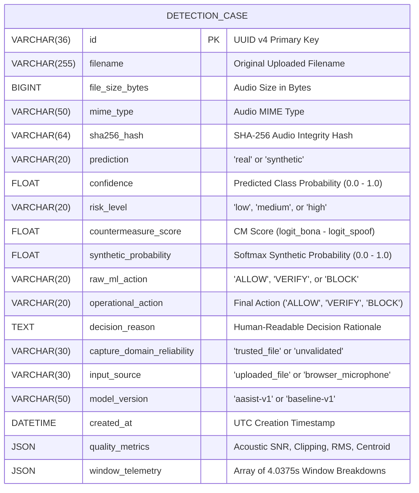

# Database Schema & Entity Design: SIH26104

## 1. Overview & Data Layer Philosophy

The **VOICE-GUARD Database Layer** is implemented using **SQLAlchemy 2.0 Async ORM** with support for SQLite (development/local testing) and PostgreSQL (production). The schema is designed for:
- **Append-Only Immutability**: Detection records are immutable forensic audit trails. Once created, records are never updated or deleted by normal application workflows.
- **Structured JSON Projections**: Complex multi-dimensional telemetry (such as per-window timestamps and acoustic quality descriptors) are stored in structured JSON columns for query efficiency.
- **Cryptographic Fingerprinting**: Every record stores a SHA-256 integrity hash of the ingested audio byte stream.

---

## 2. Entity Relationship & Schema Diagram

---

## 3. Database Indexes

To maintain sub-50ms query response times under high case volumes, the following indexes are configured in [backend/app/models/detection_case.py](file:///home/kiddo/projects/sih26104-voice-cloning/backend/app/models/detection_case.py):

| Index Column | Type | Purpose |
| :--- | :--- | :--- |
| `id` | Primary Key / Unique | Fast O(1) single-record retrieval by UUID. |
| `created_at` | B-Tree (Descending) | Fast pagination and chronological case history sorting. |
| `sha256_hash` | B-Tree | Rapid forensic deduplication and file integrity lookups. |
| `risk_level` | B-Tree | Filter queries by risk categorization (`low`, `medium`, `high`). |
| `operational_action` | B-Tree | Filter queries by operational enforcement action (`ALLOW`, `VERIFY`, `BLOCK`). |
