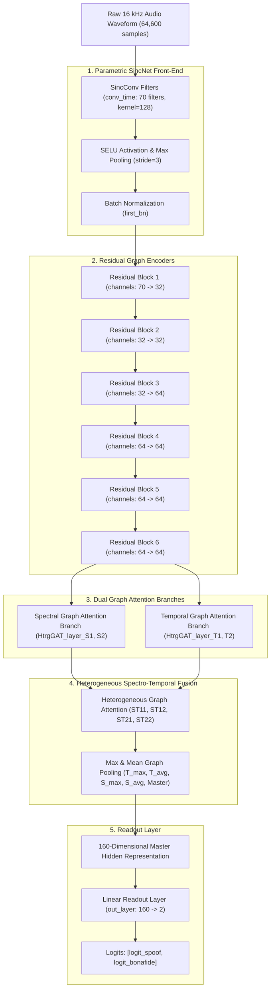

# AASIST Architecture Specification: SIH26104

## 1. Deep Learning Model Architecture

The **AASIST** architecture integrates raw waveform feature extraction with spectro-temporal graph attention networks:

---

## 2. Layer-by-Layer Mathematical Formulation

### 2.1 SincNet Parametric Bandpass Filterbank (`conv_time`)
Instead of fixed Fourier or Mel basis functions, the front-end learns 70 parametric bandpass filters directly:
$$g[n, f_1, f_2] = 2f_2 \text{sinc}(2\pi f_2 n) - 2f_1 \text{sinc}(2\pi f_1 n)$$
where $f_1, f_2$ are cut-off frequencies initialized on the Mel scale and updated during training. A Hamming window is applied to smooth filter truncations.

### 2.2 Residual Encoders
The encoder comprises 6 residual blocks using 2D convolutions with Squeeze-and-Excitation attention, SELU activations, and Max-Pooling to produce intermediate spectro-temporal feature maps $X \in \mathbb{R}^{C \times F \times T}$.

### 2.3 Heterogeneous Spectro-Temporal Graph Attention (HtrgGAT)
- **Spectral Graph**: Nodes represent spectral frequency sub-bands; edges model cross-frequency harmonic correlations.
- **Temporal Graph**: Nodes represent time frames; edges model temporal phoneme transitions.
- **Heterogeneous Graph**: A master node connects both spectral and temporal sub-graphs, enabling cross-domain attention propagation via graph attention coefficients:
  $$\alpha_{ij} = \frac{\exp\left(\text{LeakyReLU}\left(\mathbf{a}^T [\mathbf{W} \mathbf{h}_i \parallel \mathbf{W} \mathbf{h}_j]\right)\right)}{\sum_{k \in \mathcal{N}_i} \exp\left(\text{LeakyReLU}\left(\mathbf{a}^T [\mathbf{W} \mathbf{h}_i \parallel \mathbf{W} \mathbf{h}_k]\right)\right)}$$

### 2.4 Readout & 160-D Representation
Pooling extracts max and average representations across time and spectral nodes, concatenating them with the master node to yield a **160-dimensional master embedding vector**:
$$\mathbf{h}_{\text{readout}} = [\mathbf{h}_{T,\text{max}} \parallel \mathbf{h}_{T,\text{avg}} \parallel \mathbf{h}_{S,\text{max}} \parallel \mathbf{h}_{S,\text{avg}} \parallel \mathbf{h}_{\text{master}}] \in \mathbb{R}^{160}$$

The readout layer maps $\mathbf{h}_{\text{readout}}$ to 2 output logits:
$$\mathbf{z} = \mathbf{W}_{\text{out}} \mathbf{h}_{\text{readout}} + \mathbf{b}_{\text{out}} \in \mathbb{R}^2$$

---

## 3. Verified Output Indexing & Class Mapping

In the official AASIST implementation ([backend/app/ml/aasist_model.py](file:///home/kiddo/projects/sih26104-voice-cloning/backend/app/ml/aasist_model.py)):
- **Logit Index 0**: $\text{logit}_{\text{spoof}}$ (Synthetic attack score)
- **Logit Index 1**: $\text{logit}_{\text{bonafide}}$ (Organic human speech score)

### Countermeasure Score Formula:
$$CM = \text{logit}_{\text{bonafide}} - \text{logit}_{\text{spoof}} = z_1 - z_0$$

### Synthetic Probability Estimate:
$$P_{\text{synth}} = \frac{e^{z_0}}{e^{z_0} + e^{z_1}} = \frac{1}{1 + e^{z_1 - z_0}} = \frac{1}{1 + e^{CM}}$$

---

## 4. Parameter Counts Breakdown (Measured PyTorch Architecture)

| Subsystem Component | Module / Tensor Names in PyTorch | Tensor Shapes | Parameter Count |
| :--- | :--- | :--- | :--- |
| **Front-End Batch Normalization** | `first_bn.weight`, `first_bn.bias` | `[70]`, `[70]` | **2 params** |
| **Spectral Positional Encoding** | `pos_S` (Learnable Parameter) | `[1, 23, 64]` | **1,472 params** |
| **Master Node Seed Embeddings** | `master1`, `master2` (Learnable Parameters) | `[1, 1, 64]`, `[1, 1, 64]` | **128 params** (64 each) |
| **Residual Graph Encoders** | `encoder` (Blocks 1–6) | 6 Residual Blocks | **211,072 params** |
| **Spectral Graph Attention** | `GAT_layer_S` | Spectral GAT branch | **12,672 params** |
| **Temporal Graph Attention** | `GAT_layer_T` | Temporal GAT branch | **12,672 params** |
| **Heterogeneous Spectro-Temporal GAT** | `HtrgGAT_layer_ST11..ST22` | 4 Heterogeneous Layers | **59,264 params** |
| **Graph Attention Pooling Projections**| `pool_S`, `pool_T`, `pool_hS1/2`, `pool_hT1/2` | Attention Projections | **262 params** |
| **Linear Readout Head** | `out_layer.weight`, `out_layer.bias` | `[2, 160]`, `[2]` | **322 params** |
| **Total AASIST Architecture** | Full PyTorch Network (`Model`) | — | **297,866 parameters** |

### Arithmetic Verification:
$$2 + 1,472 + 128 + 211,072 + 12,672 + 12,672 + 59,264 + 262 + 322 = \mathbf{297,866\ parameters}$$

> [!NOTE]
> - **Full Model**: All **297,866 parameters** are trainable.
> - **Stage 3 Classifier-Head Adaptation**: The backbone (**297,544 parameters**) is frozen, leaving only the **322 parameters** of `out_layer` trainable ($297,866 - 322 = 297,544$).
> - **Front-End Filters**: The SincNet filter cut-off frequencies ($f_1, f_2$) are registered buffers/tensors in `conv_time` rather than unconstrained weights.
