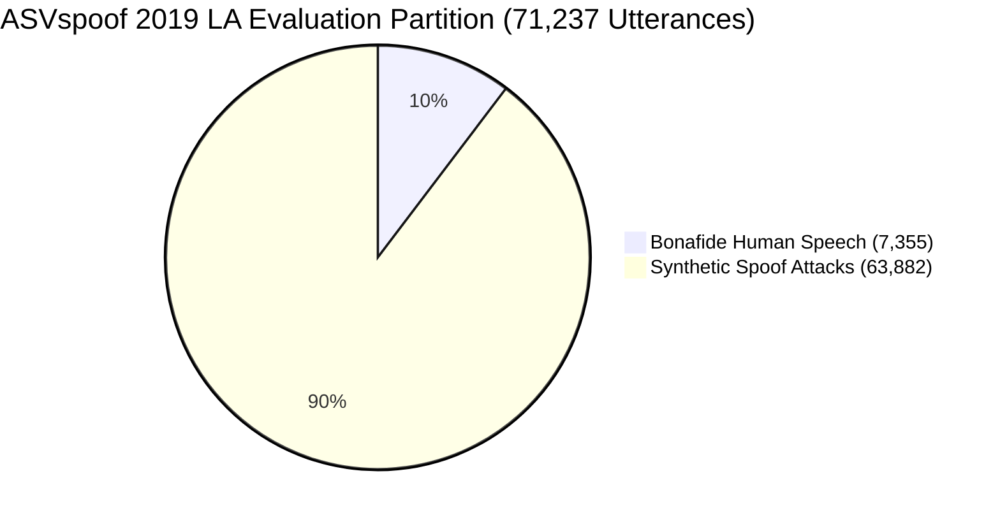

# ASVspoof 2019 LA Benchmark Dataset: SIH26104

## 1. Overview of ASVspoof 2019 Logical Access (LA)

The **ASVspoof 2019 Logical Access (LA)** dataset is the global gold-standard academic benchmark for evaluating biometric voice anti-spoofing and synthetic speech detection systems.

It evaluates models against **19 distinct speech synthesis (TTS) and voice conversion (VC) attack algorithms**:
- **Known Attacks (A01–A06)**: Present in the training and development partitions.
- **Unknown Attacks (A07–A19)**: Reserved exclusively for the evaluation partition to measure generalized out-of-domain attack detection.

---

## 2. Dataset Partitions & Protocols



| Partition | Speakers | Bonafide Utterances | Spoof Utterances | Total Utterances | Primary Purpose |
| :--- | :--- | :--- | :--- | :--- | :--- |
| **Train (`trn`)** | 20 (8M / 12F) | 2,580 | 22,800 | 25,380 | Model parameter optimization. |
| **Dev (`dev`)** | 20 (8M / 12F) | 2,548 | 22,296 | 24,844 | Hyperparameter tuning and validation. |
| **Eval (`eval`)** | 48 (21M / 27F)| 7,355 | 63,882 | **71,237** | **Final unbiased academic benchmark.** |

---

## 3. Attack Algorithm Taxonomy in ASVspoof 2019 LA

| Attack ID | Category | Algorithm & Vocoder Details | Partition |
| :--- | :--- | :--- | :--- |
| **A01** | TTS | Neural network acoustic model + WaveNet vocoder | Train / Dev |
| **A02** | TTS | Acoustic model + WORLD vocoder | Train / Dev |
| **A03** | TTS | Acoustic model + Griffin-Lim linear reconstruction | Train / Dev |
| **A04** | VC | Waveform filtering + spectral transformation | Train / Dev |
| **A05** | VC | VAE-based voice conversion + WORLD vocoder | Train / Dev |
| **A06** | VC | Neural network transfer + STRAIGHT vocoder | Train / Dev |
| **A07–A19**| TTS / VC | Modern zero-shot autoregressive TTS, GAN vocoders, WaveGlow, Diffusion, CycleGAN VC | **Eval Only (Unseen)** |

---

## 4. Dataset Directory Layout in Repository

The evaluation partition is located in `datasets/ASVspoof2019_LA/` (gitignored):

```
datasets/ASVspoof2019_LA/
└── LA/
    ├── ASVspoof2019_LA_cm_protocols/
    │   ├── ASVspoof2019.LA.cm.train.trn.txt
    │   ├── ASVspoof2019.LA.cm.dev.trl.txt
    │   └── ASVspoof2019.LA.cm.eval.trl.txt
    ├── ASVspoof2019_LA_train/flac/     # 25,380 FLAC files
    ├── ASVspoof2019_LA_dev/flac/       # 24,844 FLAC files
    └── ASVspoof2019_LA_eval/flac/      # 71,237 FLAC files
```
