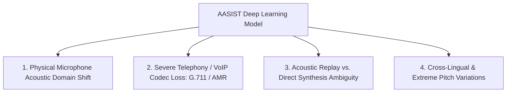

# Machine Learning Limitations & Threat Boundaries: SIH26104

## 1. Technical Limitations of AASIST

While AASIST delivers state-of-the-art benchmark performance on clean 16 kHz studio recordings (0.80% EER on ASVspoof 2019), several critical limitations exist in real-world deployment:

---

## 2. Detailed Limitation Profiles

### 2.1 Physical Microphone Acoustic Domain Shift
- **Cause**: AASIST was trained predominantly on clean studio speech recorded with high-end cardioid condenser microphones. Low-cost consumer MEMS microphones (laptops, smartphones) introduce non-linear diaphragm resonances, room reverberation, and browser WebRTC automatic gain control (AGC) phase distortion.
- **Impact**: On raw browser microphone captures, genuine human speech frequently produces negative countermeasure scores ($CM \approx -15.0$) and high synthetic probabilities ($P_{\text{synth}} \approx 1.0$).
- **Mitigation in VOICE-GUARD**: The platform enforces the **Capture-Domain Safety Protocol**, isolating browser microphone captures to `unvalidated` and emitting an operational action of `VERIFY` (MFA challenge) rather than `BLOCK`.

### 2.2 Telephony & VoIP Codecs (G.711, AMR, Speex)
- **Cause**: Narrowband telephony codecs band-limit speech to 300 Hz – 3,400 Hz (8 kHz sampling rate) and discard high-frequency phase coherence.
- **Impact**: AASIST SincNet filters above 4 kHz receive zero acoustic energy, degrading detection accuracy on cellular/PSTN phone calls.
- **Mitigation**: Up-sampling and neural bandwidth extension are recommended for future telephony adapters.

### 2.3 Physical Acoustic Replay Attacks
- **Cause**: An attacker playing a cloned voice through a smartphone speaker into a laptop microphone introduces physical room acoustics that can mask high-frequency vocoder phase artifacts.
- **Impact**: Pure synthetic classifiers may classify the recording as "noisy real speech" rather than a synthetic attack.

### 2.4 Extreme Emotional & Vocal Pathologies
- Whispered speech, severe hoarseness, vocal fry, or extreme emotional shouting alter vocal tract glottal pulse timing, occasionally triggering elevated false positive rates.
