# Multi-Window Temporal Inference & Aggregation: SIH26104

## 1. The Short-Duration Splicing Threat

A major vulnerability in voice anti-spoofing systems is **short-duration audio splicing**. An attacker may record 10 seconds of authentic human conversation and insert a 500 ms cloned phrase (e.g. *"Yes, transfer the funds"*).

- If a model truncates audio to the first 3 seconds, splices occurring after 3 seconds are missed entirely.
- If a model computes an unweighted arithmetic mean over all windows, a single high-risk cloned window ($P_{\text{synth}} = 0.98$) diluted by 9 clean windows ($P_{\text{synth}} = 0.05$) yields an average of $P_{\text{avg}} = 0.143$, resulting in an incorrect `ALLOW` decision.

---

## 2. Multi-Window Segmentation Geometry

In [backend/app/ml/aasist_inference.py](file:///home/kiddo/projects/sih26104-voice-cloning/backend/app/ml/aasist_inference.py) and [backend/app/services/detection/aasist_service.py](file:///home/kiddo/projects/sih26104-voice-cloning/backend/app/services/detection/aasist_service.py), the inference engine implements **75% Overlapping Multi-Window Inference**:

```mermaid
gantt
    title 75% Overlapping Multi-Window Sliding Segmentation (16,150-sample / ~1.01s Hop)
    dateFormat X
    axisFormat %s
    section Window 0
    [0.00s - 4.04s] : 0, 4
    section Window 1
    [1.01s - 5.05s] : 1, 5
    section Window 2
    [2.02s - 6.06s] : 2, 6
    section Window 3
    [3.03s - 7.07s] : 3, 7
    section Window 4
    [4.04s - 8.08s] : 4, 8
```



### Exact Production Constants:
| Constant / Parameter | Source Value | Seconds Equivalent | Rationale |
| :--- | :--- | :--- | :--- |
| **`TARGET_SAMPLE_RATE`** | `16,000 Hz` | — | Standardized 16 kHz acoustic frequency baseline. |
| **`TARGET_SAMPLE_COUNT`** | `64,600 samples` | `4.0375 seconds` | Native AASIST SincNet input tensor dimension. |
| **`TARGET_HOP_COUNT`** | `16,150 samples` | `1.009375 seconds (~1.01s)` | **75% Overlap**: Dense temporal sampling ensuring transient splices are centered in multiple overlapping receptive fields. |
| **`MAX_AUDIO_DURATION_SECONDS`**| `300.0 seconds` | `5.0 minutes` | Bounded duration limit preventing denial of service. |
| **`MAX_MULTIWINDOW_WINDOWS`** | `350 windows` | — | Safety ceiling on number of sliding windows. |
| **`batch_size`** | `16` | — | Bounded mini-batch size for GPU/CPU memory efficiency with automatic CUDA OOM CPU fallback. |

---

## 3. Pre-Inference Silence & Low-Energy Exclusion (Option A)

To prevent silence or near-silence windows from polluting the aggregation, each window is evaluated for acoustic activity before neural inference:

$$\text{rms\_dbfs} = 20 \log_{10}\left(\sqrt{\frac{1}{L}\sum_{n=1}^L x[n]^2} + 10^{-12}\right)$$

- **Low-Energy Window** ($\text{rms\_dbfs} < -55.0\text{ dBFS}$ or active speech fraction $< 0.05$): Marked as `low_energy`, `aggregation_eligible = False`. Excluded from neural forward pass and risk aggregation.
- **Sparse Speech Window** ($0.05 \le \text{active fraction} < 0.45$): Inferred and included in aggregation.
- **Active Speech Window** ($\text{active fraction} \ge 0.45$): Inferred and included in aggregation.

---

## 4. `max_v1` Conservative Maximum Risk Aggregation

The production aggregator (`aggregate_max_v1`) implements worst-case security evaluation across all eligible speech windows:

```python
def aggregate_max_v1(window_probs: list[float], cm_scores: list[float]) -> tuple[float, float, float]:
    if not window_probs:
        return 0.0, 1.0, 0.0
    max_synth = float(max(window_probs))
    real_prob = round(1.0 - max_synth, 4)
    min_cm = float(min(cm_scores))
    return max_synth, real_prob, min_cm
```

- **File Synthetic Probability**: $P_{\text{synth}} = \max_{w \in \text{eligible}} P_{\text{synth}, w}$
- **File Real Probability**: $P_{\text{real}} = 1.0 - P_{\text{synth}}$
- **File Countermeasure Score**: $CM = \min_{w \in \text{eligible}} CM_w$

### Suspicious Segment Localization:
Overlapping or contiguous windows with $P_{\text{synth}} \ge 0.50$ are merged into distinct intervals via `extract_suspicious_segments()`, reporting peak synthetic probability, minimum countermeasure score, and exact time boundaries (`start_seconds`, `end_seconds`) for security analysts.
