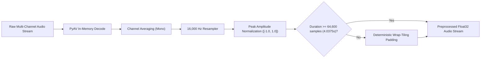

# Audio Preprocessing & Normalization: SIH26104

## 1. Preprocessing Philosophy

Audio pre-processing must be deterministic, mathematically robust, and zero-loss with respect to high-frequency neural vocoder artifacts. The preprocessor standardizes audio from diverse containers and sample rates into clean 16 kHz Float32 tensors.

---

## 2. Preprocessing Specifications

| Parameter | Production Value | Rationale |
| :--- | :--- | :--- |
| **Sampling Rate ($f_s$)** | `16,000 Hz` | Standard speech biometric sampling rate. Captures up to 8 kHz Nyquist frequency, covering fundamental formants and vocoder phase band gaps. |
| **Channel Layout** | `Mono` ($1$ Channel) | Eliminates stereo phase cancellation artifacts. Multi-channel inputs are averaged: $x_{\text{mono}}[n] = \frac{1}{C}\sum_{c=1}^C x_c[n]$. |
| **Data Format** | `Float32` ($[-1.0, 1.0]$) | Native 32-bit floating point required by PyTorch SincNet filterbanks. |
| **Target Window Length** | `64,600 samples` ($4.0375\text{ s}$) | Official AASIST input tensor length ($4\text{ seconds} + 600\text{ samples}$ margin). |
| **Short-Audio Padding** | `Wrap-Tiling` | Clips $< 4.0375\text{ s}$ are repeated periodically until $\ge 64,600$ samples, avoiding silence boundary discontinuities. |

---

## 3. Padding Strategy Comparison

### Zero-Padding vs. Wrap-Tiling:
1. **Zero-Padding Problem**: Appending zeros creates a step discontinuity at the boundary. SincNet bandpass filters treat steep zero-transitions as high-frequency transient spikes, artificially inflating the synthetic probability score.
2. **Wrap-Tiling Solution**: Repeating natural speech retains continuous acoustic resonance across the 64,600-sample tensor without introducing synthetic impulse artifacts.
