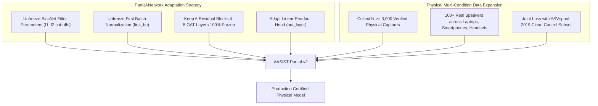

# Future Domain Adaptation Roadmap: SIH26104

## 1. Architectural Path to Physical Generalization

The Stage 4 empirical findings demonstrated that **readout head fine-tuning is insufficient** because acoustic domain shifts corrupt the raw waveform representations inside the **SincNet front-end filterbanks**.

To achieve true physical microphone-domain generalization without catastrophic forgetting on clean anti-spoofing benchmarks, the following multi-stage strategy is recommended:

---

## 2. Recommended Engineering Milestones

### Milestone 1: Partial SincNet Unfreezing
- Make the 70 parametric sinc bandpass filters ($f_1, f_2$ cut-off frequencies, total 140 learnable floats) trainable.
- Unfreeze the first `BatchNorm1d` layer (`first_bn`) to adjust running mean and variance to microphone pre-amp noise floors.
- Keep all 187,328 residual parameters and 108,710 graph attention parameters frozen.

### Milestone 2: Multi-Hardware Physical Capture Pool
- Expand verified physical recordings to $N \ge 3,000$ utterances across 100+ unique human speakers.
- Include physical acoustic replay attacks played through consumer transducers (smartphones, Bluetooth speakers) in varied acoustic room geometries.

### Milestone 3: Joint Domain-Loss Optimization
- Train with a joint loss function:
  $$\mathcal{L}_{\text{total}} = \mathcal{L}_{\text{CE}}(\text{Mic Domain}) + \lambda \cdot \mathcal{L}_{\text{CE}}(\text{ASVspoof Control})$$
  with $\lambda = 1.0$, enforcing zero regression on clean studio benchmarks while adapting SincNet filters to physical hardware.
