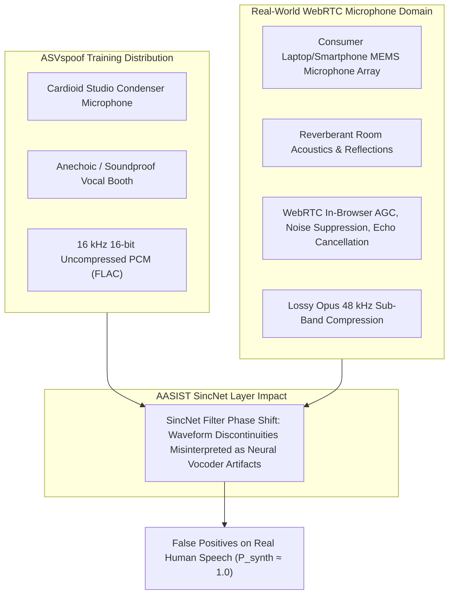

# The Microphone Domain-Shift Problem: SIH26104

## 1. Problem Definition & Discovery

During real-world testing of the frozen production **AASIST** model (`AASIST.pth`) on live browser microphone recordings, an unexpected acoustic anomaly was discovered:

> **Live Microphone Failure**: Genuine human speech recorded directly through standard laptop microphone arrays (e.g. Dell XPS, Google Chrome 128, WebM/Opus) consistently produced **$P_{\text{synth}} \approx 1.0000$** and a **$100\%$ False Positive Rate ($CM \approx -15.0$ to $-22.0$)**, triggering immediate false `BLOCK` actions under uncalibrated threshold policies.

---

## 2. Why Domain Shift Occurs in Raw Waveform SincNet Models



### Technical Root Causes:
1. **SincNet Filter Sensitivity**: SincNet directly convolves parametric sinc kernels with raw time-domain samples. It is exceptionally sensitive to localized phase discontinuities.
2. **Browser WebRTC DSP**: Browsers apply Automatic Gain Control (AGC), non-linear noise suppression, and acoustic echo cancellation (AEC) before encoding speech into Opus/WebM. SincNet interprets these non-linear transformations as vocoder synthesis glitches.
3. **MEMS Transducer Frequency Curves**: Consumer microphones exhibit non-flat frequency response curves with high-frequency roll-off and low-frequency resonance peaks.

---

## 3. Four-Stage Research Progression

To rigorously investigate and address this challenge, a four-stage experimental roadmap was executed:

```
Stage 1: Domain-Shift Diagnosis & Multi-Device Acoustic Audit
    ↓
Stage 2: Pilot Dataset Build (30 Speakers, 300 Utterances) & Frozen Evaluation
    ↓
Stage 3: Classifier-Head Fine-Tuning Experiment (aasist-mic-head-v1-exp)
    ↓
Stage 4: Physical Transducer Challenge Set Validation & Verification
```

---

## 4. Operational Safety Invariant

While research into multi-condition adaptation is ongoing, the **Production Decision Engine** enforces an absolute safety guarantee:

```python
if input_source == "browser_microphone":
    capture_domain_reliability = "unvalidated"
    final_action = "VERIFY"
```

This guarantees that real users recording through browser microphones are **never blocked**, preserving both biometric security and user experience.
