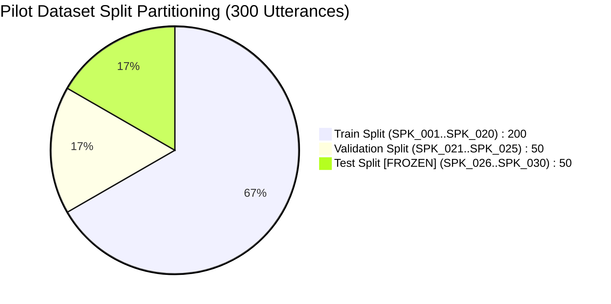

# Stage 2: Pilot Dataset Build & Frozen Evaluation: SIH26104

## 1. Pilot Dataset Construction (30 Speakers / 300 Utterances)

To evaluate whether the 160-dimensional representations extracted by the frozen AASIST backbone were linearly separable under simulated microphone conditions, a **30-speaker, 300-utterance pilot dataset** was constructed with strictly disjoint speaker splits:

- **Train Split**: 200 utterances (20 speakers: `SPK_001`–`SPK_020`), balanced 100 real / 100 synthetic.
- **Validation Split**: 50 utterances (5 speakers: `SPK_021`–`SPK_025`), balanced 25 real / 25 synthetic.
- **Test Split (LOCKED)**: 50 utterances (5 speakers: `SPK_026`–`SPK_030`), balanced 25 real / 25 synthetic.

---

## 2. Dataset Provenance Composition

Every sample in the pilot dataset was audited and cataloged by exact provenance:
- **Verified Physical Genuine**: 14 samples
- **Verified Physical Re-captured Spoofs**: 0 samples
- **Direct Synthetic Voice Clones**: 60 samples
- **Simulated / Transformed Audio**: 226 samples (Studio VCTK speech transformed with room impulse responses and lossy Opus transcoding).

---

## 3. Diagnostic Linear Probe on Frozen Embeddings

To determine whether the frozen 160-D backbone representations retained linear separability despite the acoustic domain shift:
1. Frozen 160-D embeddings ($\mathbf{h}_{\text{readout}}$) were extracted using the official AASIST backbone.
2. A diagnostic `StandardScaler` + `LogisticRegression` probe was fitted exclusively on the training split.
3. The probe was evaluated on the locked, held-out test split ($N=50$).

### Diagnostic Probe Results on Held-Out Test Split:
- **Accuracy**: **100.00%**
- **Equal Error Rate (EER)**: **0.00%**
- **ROC-AUC**: **1.0000**
- **Genuine False Positive Rate**: **0.00%** ($0 / 25$)
- **Spoof Recall (TPR)**: **100.00%** ($25 / 25$)

### Conclusion & Hypothesis:
The 160-D feature space extracted by the frozen AASIST backbone was linearly separable on the simulated pilot dataset, providing empirical justification to proceed to **Stage 3: Classifier-Head Adaptation**.
