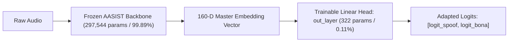

# Stage 3: Classifier-Head Adaptation Experiment: SIH26104

## 1. Experimental Setup (`aasist-mic-head-v1-exp`)

**Objective**: Train an experimental readout head (`out_layer`, 322 parameters) on the frozen 160-D AASIST embeddings to adapt the decision boundary to microphone acoustics without modifying the 297,544 backbone parameters (lower risk of catastrophic forgetting).

---

## 2. Training Configuration & Multi-Seed Search

- **Training Data**: 200 microphone train samples + 200 ASVspoof train control samples (balanced bonafide and spoof).
- **Optimizer**: AdamW (weight decay: $1\times 10^{-4}$, batch size: 16).
- **Epochs**: 25 (Early stopping on validation loss/EER, patience: 4).
- **Search Grid**: 3 Learning rates ($1\times 10^{-4}, 3\times 10^{-4}, 1\times 10^{-3}$) $\times$ 3 Seeds ($42, 1337, 2026$) = 9 runs.

### Multi-Seed Validation Outcomes:
Across all 9 runs, validation EER reached **0.00%** and validation ROC-AUC reached **1.0000**.  
The candidate with the lowest validation loss was selected: `LR = 1e-3, Seed = 42` (Val Loss: `0.0037`).

---

## 3. Results on Locked Pilot Test Set ($N=50$)

| Metric | Baseline `aasist-v1` (Frozen) | Adapted Head (`aasist-mic-head-v1-exp`) | Pilot Target Gate |
| :--- | :--- | :--- | :--- |
| **Accuracy** | 100.00% *(Simulated)* | **100.00%** | $> 95.00\%$ |
| **EER** | 0.00% *(Simulated)* | **0.00%** | $\le 3.00\%$ |
| **ROC-AUC** | 1.0000 *(Simulated)* | **1.0000** | $\ge 0.9500$ |
| **Genuine FPR** | 0.00% *(Simulated)* | **0.00%** | $\le 5.00\%$ |
| **Spoof Recall (TPR)** | 100.00% | **100.00%** | $\ge 90.00\%$ |
| **ASVspoof 2019 EVAL EER**| **0.8047%** | **0.8047% (Zero Regression)** | $\le 1.0000\%$ |

---

## 4. Temperature Scaling Calibration

Temperature scaling was fitted on validation logits via L-BFGS optimization:
- **Learned Optimal Temperature**: $T = 1.1309$
- **Effect**: Softened saturated logit boundaries, reducing Brier probability sharpness without modifying the ROC rank ordering.
