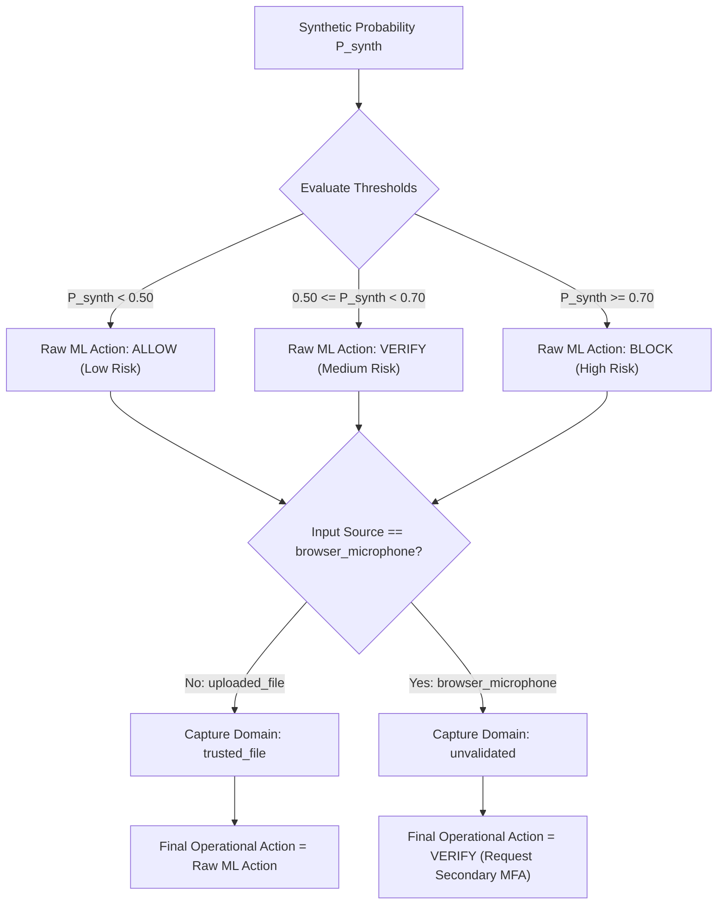

# Decision Engine & Security Policy Rules: SIH26104

## 1. Production Decision Engine Architecture (`backend/app/services/decision_engine.py`)

The **Decision Engine** translates raw machine learning synthetic probability estimates into deterministic, auditable security enforcement actions.

---

## 2. Threshold Specification (Source of Truth)

Directly verified in [backend/app/services/decision_engine.py](file:///home/kiddo/projects/sih26104-voice-cloning/backend/app/services/decision_engine.py#L7-L11):

| Synthetic Probability Range | Raw ML Action | Risk Level | Operational Interpretation |
| :--- | :--- | :--- | :--- |
| **$P_{\text{synth}} < 0.50$** | `ALLOW` | `low` | High probability of authentic human speech. Low security risk. Permitted to proceed. |
| **$0.50 \le P_{\text{synth}} < 0.70$** | `VERIFY` | `medium` | Borderline / ambiguous acoustic features. Secondary verification (e.g. OTP, push MFA) required. |
| **$P_{\text{synth}} \ge 0.70$** | `BLOCK` | `high` | High probability of AI voice cloning or synthetic spoof attack. Transaction blocked immediately. |

---

## 3. Raw ML Result vs. Final Operational Action

The platform maintains a strict architectural separation between **Raw ML Evidence** and the **Final Operational Action**:

1. **Raw ML Result**: Preserves unconstrained model outputs ($CM$, $P_{\text{synth}}$, `raw_ml_action`) for forensic and mathematical integrity.
2. **Final Operational Action**: Governed by real-world security context. When `input_source == "browser_microphone"`, the system overrides any tentative `ALLOW` or `BLOCK` to emit `VERIFY`, safeguarding against microphone acoustic domain shift while prompting the user for secondary authentication.
