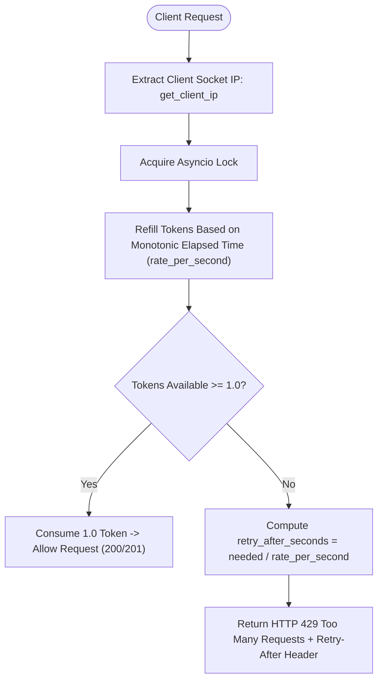

# Rate Limiting & Abuse Prevention: SIH26104

## 1. Rate Limiter Architecture

To prevent API flooding, automated model probing, and Denial of Service (DoS) attacks, the backend implements a **Process-Local Token Bucket Rate Limiter with Monotonic Clock** in [backend/app/core/rate_limiter.py](file:///home/kiddo/projects/sih26104-voice-cloning/backend/app/core/rate_limiter.py).



---

## 2. Token Bucket Implementation Details

### Core Class: `TokenBucket`
- **Refill Algorithm**: Continuous refill based on monotonic clock elapsed time ($\Delta t = \text{now} - \text{last\_update}$):
  $$\text{tokens} = \min(\text{capacity}, \text{tokens} + \Delta t \times \text{rate\_per\_second})$$
- **Clock Source**: Python `time.monotonic` (immune to system wall-clock adjustments or NTP drift).
- **Concurrency & Thread Safety**: Protected via `asyncio.Lock` across asynchronous FastAPI coroutines.
- **IP Extraction**: Direct socket connection host (`request.client.host`), ignoring untrusted spoofed proxy headers in local development.

---

## 3. Rate Limit Policy Configuration

| Endpoint Route | Default Rate / Minute | Burst Capacity | Environment Variable | HTTP Error Response |
| :--- | :--- | :--- | :--- | :--- |
| **`POST /api/v1/detections`** | **10 req / min** | **3 tokens** | `DETECTION_RATE_LIMIT_PER_MINUTE`, `DETECTION_RATE_LIMIT_BURST` | `HTTP 429` + `Retry-After` |
| **`GET /api/v1/detections/{id}/report`** | **30 req / min** | **15 tokens** | `REPORT_RATE_LIMIT_PER_MINUTE` | `HTTP 429` + `Retry-After` |
| **`GET /api/v1/detections`** | **60 req / min** | **30 tokens** | `HISTORY_RATE_LIMIT_PER_MINUTE` | `HTTP 429` + `Retry-After` |

### HTTP 429 Payload Example:
```json
{
  "detail": "Rate limit exceeded for voice cloning analysis. Please retry later."
}
```
**Headers**: `Retry-After: 6`

---

## 4. Multi-Instance Production Scaling (Redis Token Bucket)

The current implementation is **process-local** (in-memory dictionary keyed by client IP), which is lightweight and zero-dependency for single-process instances.

In multi-worker production deployments behind a reverse proxy (e.g. NGINX / Cloudflare):
1. The `consume()` logic is designed to be backed by a **Redis Token Bucket Lua script**.
2. Client IP extraction will incorporate validated trusted proxy headers (`CF-Connecting-IP` or `X-Forwarded-For` with trusted proxy CIDR filtering).
