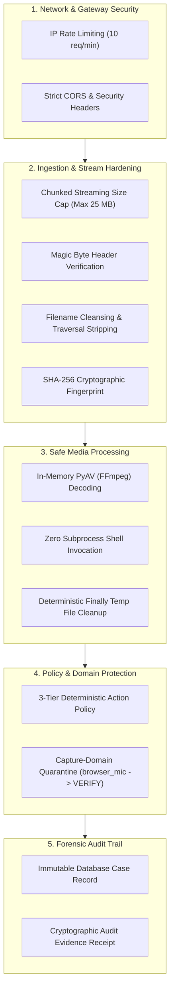

# Security Architecture & Defense-in-Depth: SIH26104

## 1. Security Philosophy

The **VOICE-GUARD Security Subsystem** applies defense-in-depth principles across the entire audio ingestion, decoding, inference, and persistence lifecycle. The system is hardened against malicious audio uploads, Denial of Service (DoS) attacks, model inversion, memory exhaustion, and audit tampering.

---

## 2. Security Controls Matrix

| Security Layer | Implemented Control | Threat Mitigated |
| :--- | :--- | :--- |
| **Network** | Process-Local Token Bucket Rate Limiting (10 req/min, burst 3) | API brute-forcing, automated DoS, model inversion attacks. |
| **Network** | Restricted CORS & Security Headers | Cross-site request forgery, iframe clickjacking. |
| **Ingestion** | Streaming 25 MB chunked size enforcement | Memory exhaustion, zip bombs, oversized file buffer overflows. |
| **Ingestion** | Magic Byte Header Matching (`RIFF`, `OggS`, `EBML`, `fLaC`, `ID3`)| Executable spoofing, polyglot files, non-audio uploads. |
| **Ingestion** | Path sanitization (`os.path.basename`, traversal stripping) | Path traversal attacks (`../../etc/passwd`). |
| **Ingestion** | SHA-256 integrity hash generation | File tampering, chain-of-custody disputes. |
| **Processing**| In-memory PyAV stream decoding without shell subprocesses | Shell injection vulnerabilities, command injection. |
| **Processing**| Deterministic `finally` cleanup of disk artifacts | Disk exhaustion via temporary upload accumulation. |
| **Inference** | Async thread offloading (`asyncio.to_thread`) | Event loop starvation, API thread blocking. |
| **Policy** | Capture-domain reliability override (`unvalidated` $\to$ `VERIFY`) | False positive account lockouts from microphone domain shift. |
| **Audit** | Immutable append-only audit records and JSON report receipts | Non-repudiation, compliance audit falsification. |
