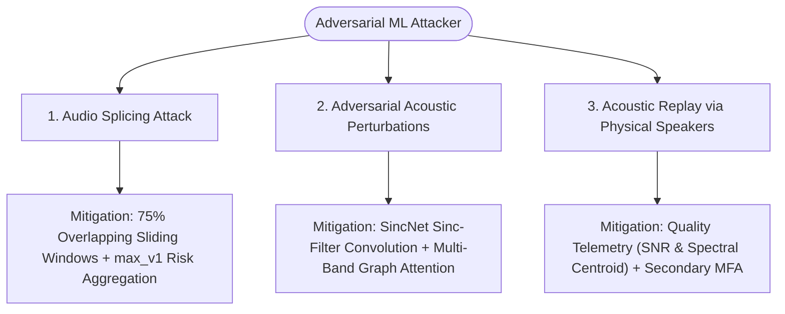

# Threat Model & Vulnerability Analysis: SIH26104

## 1. System Threat Model (STRIDE Methodology)

The system threat model follows the Microsoft **STRIDE** methodology:

| Threat Category | Potential Attack Vector | Implemented Mitigation in VOICE-GUARD |
| :--- | :--- | :--- |
| **Spoofing (Identity)** | Fraudster uses ElevenLabs / RVC clone to impersonate customer voice. | Direct raw waveform AASIST deep learning inspection + multi-window splice detection. |
| **Tampering (Data)** | Attacker modifies audio file after forensic analysis to dispute verdict. | SHA-256 cryptographic integrity hash calculated at ingestion and stored in audit ledger. |
| **Repudiation** | Customer denies authorizing a blocked fraudulent transaction. | Comprehensive JSON audit evidence receipt (`/report`) documenting exact forensic metrics. |
| **Information Disclosure**| Attacker probes API with malformed audio to extract server stack traces. | Sanitized global error handlers returning generic error messages without stack traces. |
| **Denial of Service** | Flooding backend with 10 GB files or rapid audio submission loops. | 25 MB chunked upload size enforcement + IP-based token bucket rate limiting (10 req/min, burst 3). |
| **Elevation of Privilege**| Path traversal via filenames (`../../etc/passwd`). | Strict filename sanitization (`os.path.basename`) and deterministic temp file isolation. |

---

## 2. Adversarial Machine Learning Threat Analysis

1. **Audio Splicing Attacks**: Mitigated via 64,600-sample sliding windows with $75\%$ overlap (16,150-sample hop), low-energy silence exclusion, and `max_v1` conservative risk aggregation.
2. **Adversarial Waveform Perturbations**: SincNet parametric filters convolve directly with time-domain waveforms, making high-frequency gradient noise harder to optimize across heterogeneous spectro-temporal graph attention branches.
3. **Physical Acoustic Replay**: Mitigated by combining neural countermeasure scores with acoustic quality telemetry (SNR, clipping, spectral centroid) and operational `VERIFY` policy enforcement.
