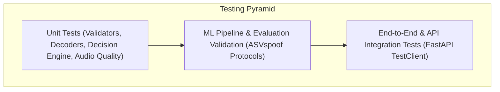

# Testing Strategy & Quality Assurance: SIH26104

## 1. Testing Philosophy & Test Pyramid

The **VOICE-GUARD Testing Strategy** enforces rigorous automated verification across unit, integration, security, and machine learning evaluation layers.

---

## 2. Automated Test Suite Metrics

Current verified results from the automated backend test suite (`pytest`):
- **Total Automated Tests**: **123 Passed**
- **Execution Time**: $\approx 11.27\text{ seconds}$
- **Test Modules**:
  - `test_aasist_service.py` (8 tests)
  - `test_audio_decoder.py` (6 tests)
  - `test_audio_quality.py` (16 tests)
  - `test_dataset_and_metrics.py` (27 tests)
  - `test_decision_engine.py` (7 tests)
  - `test_detections.py` (9 tests)
  - `test_evidence_report.py` (7 tests)
  - `test_health.py` (2 tests)
  - `test_ml_baseline.py` (16 tests)
  - `test_multi_window_aasist.py` (6 tests)
  - `test_security_hardening.py` (19 tests)

---

## 3. Continuous Integration & Quality Gates

Before any commit or release, three automated gates must pass:
1. **Backend Test Suite**: `pytest` passes with 0 failures (`123 passed`).
2. **Frontend Typecheck & Build**: `npm run build` succeeds with zero TypeScript or Next.js build errors.
3. **Git Hygiene**: `git diff --check` passes with zero whitespace or line ending issues.
