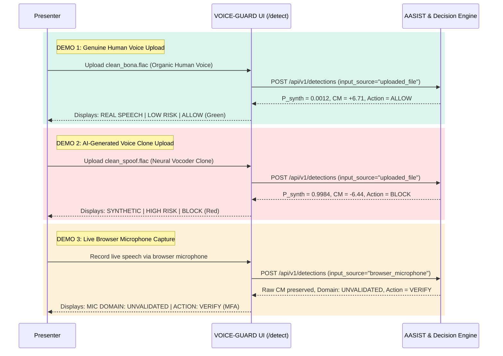

# Hackathon Live Demonstration Script: SIH26104

## 1. Demonstration Setup & Sequence

This document provides a three-part live demonstration script designed to showcase the capabilities of the **VOICE-GUARD (SIH26104)** platform to hackathon judges.

---

## 2. Live Demo Script

---

## 3. Step-by-Step Presentation Points

### DEMO 1 — Genuine Human Speech Upload
- **Action**: Upload `backend/uploads/088b2c0c-ffce-43b4-9993-5055379c374b_clean_bona.flac`.
- **Expected Outcome**:
  - **Verdict**: `REAL SPEECH`
  - **Risk Rating**: `LOW RISK`
  - **Operational Action**: `ALLOW`
  - **Countermeasure Score**: Positive ($CM > +5.0$)
- **Talking Point**: *"AASIST directly inspects the raw waveform using SincNet filters. Natural glottal pulse timing and organic harmonic resonance yield a high positive countermeasure score, permitting the customer to proceed without friction."*

---

### DEMO 2 — AI-Generated Deepfake Audio Upload
- **Action**: Upload `backend/uploads/37a92068-d1b3-42b0-a2ac-c76d3caad80c_clean_spoof.flac`.
- **Expected Outcome**:
  - **Verdict**: `SYNTHETIC`
  - **Risk Rating**: `HIGH RISK`
  - **Operational Action**: `BLOCK`
  - **Countermeasure Score**: Negative ($CM < -5.0$, $P_{\text{synth}} \ge 0.70$)
- **Talking Point**: *"Even though the cloned voice sounds convincing to the human ear, SincNet and Heterogeneous Graph Attention detect sub-band phase discontinuities produced by the neural vocoder. The decision engine immediately blocks the transaction."*

---

### DEMO 3 — Live Browser Microphone Recording
- **Action**: Click **"Record Audio"**, speak for 4 seconds, and submit.
- **Expected Outcome**:
  - **Signal Quality**: `SIGNAL QUALITY: GOOD`
  - **Capture Domain**: `MIC DOMAIN: UNVALIDATED`
  - **Operational Action**: `VERIFY` (Secondary Multi-Factor Authentication Required)
- **Talking Point**: *"In live browser environments, consumer MEMS microphones and WebRTC automatic gain control introduce acoustic domain shift. Rather than falsely blocking a genuine customer, VOICE-GUARD's domain-aware policy preserves raw biometric evidence while safely prompting for secondary MFA."*
