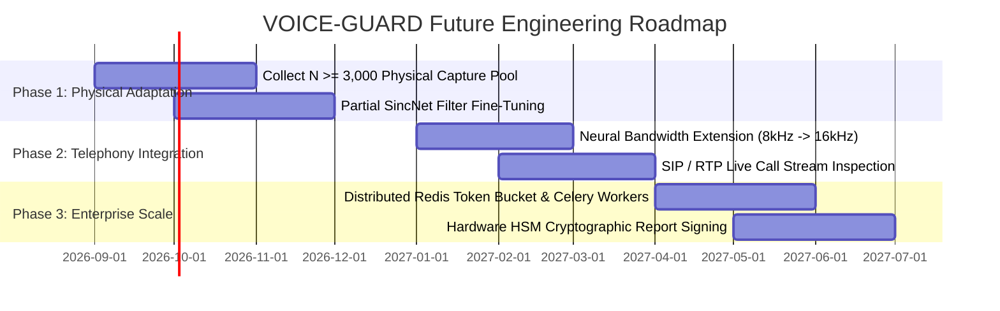

# Limitations & Future Roadmap: SIH26104

## 1. Current System Limitations (Transparent Audit)

VOICE-GUARD maintains complete transparency regarding its engineering boundaries:

| Limitation Area | Description | Current Production Handling |
| :--- | :--- | :--- |
| **Physical Microphone Domain Shift** | Raw SincNet filterbanks fire on consumer microphone phase and AGC distortions, producing false positives on live browser recordings. | Quarantined via Capture-Domain Safety Protocol: `browser_microphone` $\implies$ `capture_domain_reliability = unvalidated` $\implies$ `VERIFY` (Secondary MFA). |
| **Narrowband Telephony (8 kHz)** | G.711 / AMR telephony codecs discard acoustic energy above 3.4 kHz, degrading SincNet high-band graph attention. | Designed for 16 kHz broadband audio; telephony requires neural bandwidth extension. |
| **Acoustic Replay Ambiguity** | Cloned voice replayed over a physical speaker into a room microphone introduces physical room reverberation that can mask vocoder artifacts. | Evaluated via acoustic quality metrics (SNR, spectral centroid) and secondary verification. |

---

## 2. Future Development Roadmap

---

## 3. High-Priority Roadmap Milestones

### 1. Partial SincNet Filter Fine-Tuning
Unfreeze the 70 parametric bandpass sinc filters ($f_1, f_2$) while keeping the 6 residual blocks and 5 GAT layers frozen. Train on a verified $N \ge 3,000$ multi-speaker physical recording dataset to achieve physical microphone generalization with zero regression on studio benchmarks.

### 2. Telephony & VoIP Real-Time Bridge
Develop an in-stream SIP/RTP audio proxy capable of inspecting live banking contact center calls, performing real-time neural bandwidth extension (8 kHz $\to$ 16 kHz) before AASIST inference.

### 3. Hardware Security Module (HSM) Report Signing
Sign audit evidence reports with an enterprise X.509 cryptographic certificate backed by a Hardware Security Module (HSM) for court-admissible legal compliance.
