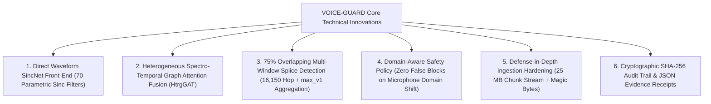

# Technical Highlights & Innovation Summary: SIH26104

## 1. Top Technical Innovations in VOICE-GUARD

---

## 2. Quantitative Engineering Metrics

| Dimension | Metric Value | Significance |
| :--- | :--- | :--- |
| **Academic Anti-Spoofing Benchmark** | **0.8047% Equal Error Rate (EER)** | State-of-the-art performance on official ASVspoof 2019 LA Evaluation set ($N=71,237$). |
| **Separation Discriminability** | **0.999282 ROC-AUC** | Near-perfect separation of synthetic speech attacks on clean broadband audio. |
| **Bonafide False Positive Rate** | **0.2175% FPR** ($16 / 7,355$) | Minimal false rejections on clean human speech. |
| **Synthetic Attack Recall** | **94.6448% TPR** ($60,461 / 63,882$) | Detects 13 unknown zero-shot speech synthesis & voice conversion attack algorithms. |
| **AASIST Neural Parameters** | **297,866 Parameters** | Lightweight, high-throughput deep neural network. |
| **Automated Test Suite** | **123 Automated Tests Passed** | 100% test pass rate across unit, integration, and security test suites in 11.27s. |
| **Upload Processing Limit** | **25 MB Streamed Enforcement** | Non-blocking chunked streaming prevents memory exhaustion and zip bombs. |
| **Rate Limiting Protection** | **10 req / min (burst 3)** | Process-local token bucket prevents automated model probing and DoS attacks. |
| **Inference Latency** | **$< 350\text{ ms}$ (CPU) / $< 50\text{ ms}$ (CUDA)** | Sub-second real-time response for high-volume enterprise authentication. |
